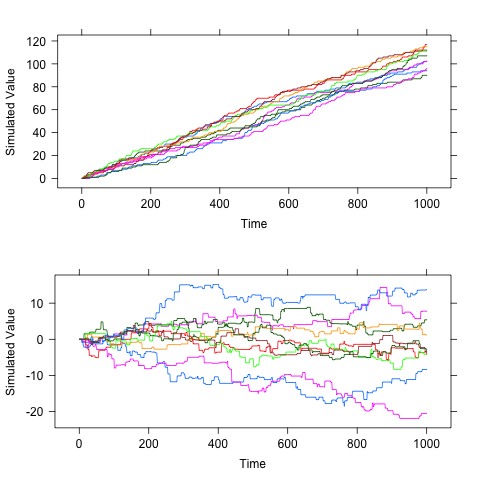

[](http://quantlet.de/)

## [](http://quantlet.de/) **PP-CPP** [](http://quantlet.de/)

```yaml

Name of QuantLet : PP-CPP

Published in : 

Description : 'Simulation of Poisson Process and Compound Poisson Process with Poisson Generating Function.'

Keywords : compound Poisson process, Poisson process, simulation, plot

Author : Xiaohao Ji

Submitted : Fri, January 04 2019 by Xiaohao Ji

```




### R Code:
```r

# Clearing Variables and Close Windows
rm(list = ls(all = TRUE))
graphics.off()

# Loading Libraries
libraries = c("ggplot2", "reshape2", "stats", "zoo", "tidyr", "lattice")

lapply(libraries, function(x) if (!(x %in% installed.packages())) {
  install.packages(x)
})

lapply(libraries, library, quietly = TRUE, character.only = TRUE)

# Poisson Generator
PPgen=function(lambda){
  X=0
  Sum=0
  flag=0

  while (flag==0){
    E=-log(runif(1)); Sum = Sum + E
    if (Sum < lambda) {X=X+1} else {flag=1}
  }
  return(X)
}

# Poisson Process
PP=function(lambda, N, T){
  h=T/N; t=(0:T)/N 
  X=rep(0, N+1)
  I=rep(0,N)
  X[1]=0
  for(i in 1:N) {
    I[i]=PPgen(h*lambda); X[i+1]=X[i] + I[i]}
  return(X)
}

#Compound Poisson Process
CPP=function(lambda, T, N) {
  h=T/N
  t=(0:T)/N
  X=rep(0, N+1)
  F=rep(0, N+1)
  I=rep(0,N)
  X[1]=0
  for(i in 1:N) {
    I[i]=PPgen(h*lambda)
    if (I[i]==0){F[i]=0} else {F[i]=rnorm(1)}
    X[i+1]=X[i] + F[i]}
  return(X)
}

# Initialization
lambda = 100
N = 1000; T = 1
stim_up = 10
col_name = c('S1', 'S2','S3', 'S4','S5', 'S6','S7', 'S8','S9', 'S10', 'time')
S_PP = matrix(0, stim_up, N+1)
S_CPP = matrix(0, stim_up, N+1)

# Generating 
for(i in 1:stim_up){
  S_CPP[i,] = CPP(lambda, T, N)
  S_PP[i,] = PP(lambda, N, T)
}
S_PP = data.frame(t(S_PP))
S_CPP = data.frame(t(S_CPP))
S_PP$time = c(0:1000)
S_CPP$time = c(0:1000)
colnames(S_PP) = col_name
colnames(S_CPP) = col_name

# Plotting
pic_1 = xyplot(S1 + S2 + S3 + S4 + S5 + S6 + S7 + S8 + S9 + S10 ~ time, data = S_PP, 
       type = "l", 
       xlab = list(label = "Time", cex = 1), 
       ylab = list(label = "Simulated Value", cex =1), 
       scales=list(tck=c(1), x=list(cex=1), y=list(cex=1)),
       # main=list(label = "Simulated Poisson Process", cex = 2),
       auto.key = FALSE)

pic_2 = xyplot(S1 + S2 + S3 + S4 + S5 + S6 + S7 + S8 + S9 + S10 ~ time, data = S_CPP, 
       type = "l", 
       xlab = list(label = "Time", cex = 1), 
       ylab = list(label = "Simulated Value", cex =1), 
       scales=list(tck=c(1), x=list(cex=1), y=list(cex=1)),
       # main=list(label = "Simulated Poisson Process", cex = 2),
       auto.key = FALSE)

print(pic_1, position=c(0, .5, 1, 1), more=TRUE)
print(pic_2, position=c(0, 0, 1, .5))
# dev.copy(png,'PP-CPP.png')
# dev.off()

```
